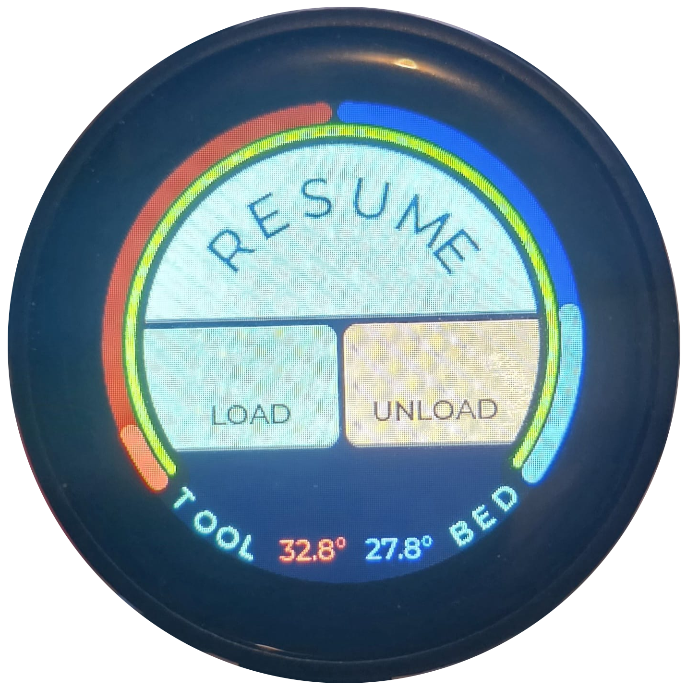
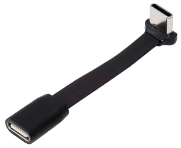

# Round Klipper Display

A custom round LCD touch panel for Klipper 3D printer firmware, built with a super cheap, round touch screen.

<div align="center">
    
    
</div>
<!-- <div align="right">
</div> -->

## Overview

This project provides a very basic graphical touch interface for Klipper-based 3D printers using a round 240x240 LCD display.
It connects to Moonraker (Klipper's API server) via WebSocket to display real-time printer status and temperatures.
It has 3 configurable buttons for telling Klipper to run a macro.


## Purpose

Like most Klipper uses of custom printers I run my printers 100% from my PC. The problem is when I have to preform a task that requires me to be physically standing at my printer.
The 3 tasks that require me to be physically at the printer is Loading new filament, Unloading filament, and Resuming after a pause/colour change where I need to remove purged material.
These 3 tasks required that I click a button on my PC, then get over to the printer in time to perform the task. Loading and unloading filament wasn't really an issue but Resuming a print could be a problem.
So I created this extremely simple, cheap and easy to use display.
The 3 buttons can be customized with any name you want (assuming it fits on the button) and to send any macro name to Klipper you want run. This is all configurable from a single config file (round_klipper_conf.h)

## Hardware

- **Display**: ESP32-2424S012C-I Round LCD Module from AliExpress
https://www.aliexpress.com/item/1005010512426009.html
<div align="left">
    
</div>


- **USB Cable**: Flat USB-C cable from Amazon
This is the Australian one - https://www.amazon.com.au/dp/B0FPCMK1J1
<div align="left">
    
</div>

### Pin Configuration

This is the default pin configuration for the device I used, if you use a different device you can modify the pin definitions in [`include/round_klipper_conf.h`](include/round_klipper_conf.h):

| Function | GPIO Pin |
|----------|----------|
| LCD SCK  | GPIO 6   |
| LCD MOSI | GPIO 7   |
| LCD CS   | GPIO 10  |
| LCD DC   | GPIO 2   |
| LCD RST  | GPIO 1   |
| Touch SDA| GPIO 4   |
| Touch SCL| GPIO 5   |

## Features

- **Real-time Temperature Display**: Shows hotend and bed temperatures in real time
- **Print Status**: Displays current printer state as a coloured arc that changes colour depending on the printer state, while printing it animates slightly
- **Touch Controls**: Three fully customizable buttons
- **WebSocket Connection**: Direct communication with Moonraker API
- **Custom UI**: Round-optimized interface using LVGL
- **Custom Touch Driver**: I couldn't find a touch driver that worked so made my own

## Prerequisites

### Klipper Setup

1. Know your Klipper network address - 'klipper.local' is preferred if it's set up that way
2. Get your Moonraker API key:
   - Navigate to `http://klipper.local/access/api_key` Or swap 'klipper.local' with your Klipper IP address
   - Copy your API key into Round_klipper_conf.h

### Software Requirements

- VSCode (recommended)
- [PlatformIO](https://platformio.org/) (recommended)
- Arduino framework
- LVGL v9.1.0+
- WebSockets library

## Installation

### 1. Clone the Repository

```bash
git clone https://github.com/yourusername/Round-Klipper-Display.git
cd Round-Klipper-Display
```

### 2. Configure WiFi & Moonraker

Edit [`include/round_klipper_conf.h`](include/round_klipper_conf.h) and update:

```cpp
// WiFi credentials
#define WIFI_SSID "Your_WiFi_SSID"         // Your WiFi network name (SSID)
#define WIFI_PASSWORD "Your_WiFi_Password" // Your WiFi network password
#define HOST_NAME "Hostname"               // Hostname for your device on the network (optional, but can be helpful for identifying it)

// Moonraker connection
#define MOONRAKER_HOST "klipper.local"    // Your Klipper hostname/IP
#define MOONRAKER_PORT 7125               // Default Moonraker port
#define MOONRAKER_API_KEY "your_api_key"  // Your Moonraker API key
```

### 3. Configure Button Macros

Update the button actions in [`include/round_klipper_conf.h`](include/round_klipper_conf.h) to match your Klipper macros
The default ones are from my configuration, you will need to make sure the macro names match your Klipper macros:

```cpp
#define RESUME_BTN_MACRO "RESUME"                // Macro to resume print
#define BOTTOM_LEFT_BTN_MACRO "LOAD_FILAMENT"    // Macro to load filament
#define BOTTOM_RIGHT_BTN_MACRO "UNLOAD_FILAMENT" // Macro to unload filament
```

### 4. Build and Upload

You are better off using the PlatformIO buttons in VSCode, but if you're more comfortable with the CLI:

```bash
# Build the project
pio run

# Upload to ESP32-C3
pio run --target upload

# Monitor serial output
pio device monitor
```

## Dependencies

- [LVGL](https://lvgl.io/) v9.1.0+ - Graphics library
- [WebSockets](https://github.com/Links2004/ArduinoWebSockets) - WebSocket client for Moonraker
- [Arduino](https://www.arduino.cc/) - ESP32 framework

## License

This project is licensed under the MIT License - see the [LICENSE](LICENSE) file for details.

## Acknowledgments

- [LVGL](https://lvgl.io/) for the excellent graphics library
- [Klipper](https://www.klipper3d.org/) community
- [Moonraker](https://github.com/Arksine/moonraker) for the Klipper API


## Print the Mount

The file for printing can be found in [`prints/`](prints/)
The model is designed for the Enders with 40x40mm extrusion base, like the Ender 3 variants.

Print it however you like, there will be some areas that need supports, I don't use supports inside the holes for the clips and inside the back cavity.
The diameter where the display goes in is a slight press fit, it should have some resistance when inserted.
The hole through the mount is the get the display out if required, ask me how I figured that out!


The little clips slide into the profile of the extrusion:
<div align="center">
    
</div>


It's easier to push the clips into the Mount first, then push the clips into the profile.
Do not glue the clips in, you'll need to adjust them as you slide them into the profile.
With all the tolerances they should be a bit of a friction fit and not require any glue.
<div align="center">
    
</div>


The cutout in the bottom of the housing for the USB cable to pass through is slightly offset.
This was because the 2 particular displays I received were slightly off from where the screen graphics displayed and where the USB plugged in. Should you need a slightly different orientation please let me know and I'll add a variant.
<div align="center">
    
</div>
