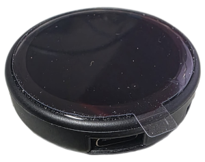

# Round Klipper Display

A custom round LCD touch panel for Klipper 3D printer firmware, built with a super cheap, round touch screen.

## Overview

This project provides a very basic graphical touch interface for Klipper-based 3D printers using a round 240x240 LCD display.
It connects to Moonraker (Klipper's API server) via WebSocket to display real-time printer status and temperatures.
It has 3 configurable buttons for telling Klipper to run a macro.


## Purpose

Like most Klipper uses of custom printers I run my printers 100% from my PC. The problem is when I have to preform a task that requires me to be physically standing at my printer.
The 3 tasks that require me to be physically at the printer is Loading new filament, Unloading filament, and Resuming after a pause/colour change where I need to remove purged material.
These 3 tasks required that I click a button on my PC, then get over to the printer in time. Loading and unloading filament wasn't really an issue but Resuming a print could be a problem.
So I created this extremely simple, cheap and easy to use display.
The 3 buttons can be customized with any name you want (assuming it fits) and to send any macro name to Klipper you want run. This is all configurable from a single config file (round_klipper_conf.h)

## Hardware

- **Device**: ESP32-2424S012C-I Round LCD Module from AliExpress
https://www.aliexpress.com/item/1005010512426009.html

- **USB Cable**: Flat USB-C cable from Amazon
This is the Australian one - https://www.amazon.com.au/dp/B0FPCMK1J1

### Pin Configuration

This is the default pin configuration for the device I used, if you use a different device this may need to be changed

| Function | GPIO Pin |
|----------|----------|
| LCD SCK  | GPIO 6   |
| LCD MOSI | GPIO 7   |
| LCD CS   | GPIO 10  |
| LCD DC   | GPIO 2   |
| LCD RST  | GPIO 1   |
| Touch SDA| GPIO 4   |
| Touch SCL| GPIO 5   |

## Features

- **Real-time Temperature Display**: Shows hotend and bed temperatures in real time
- **Print Status**: Displays current printer state as a coloured arc that changes colour depending on the printer state, while printing it animates slightly
- **Touch Controls**: Three fully customizable buttons
- **WebSocket Connection**: Direct communication with Moonraker API
- **Custom UI**: Round-optimized interface using LVGL
- **Custom Touch Driver**: I couldn't find a touch driver that worked so made my own

## Prerequisites

### Klipper Setup

1. Know your Klipper network address - 'klipper.local' is preferred if it's set up that way
2. Get your Moonraker API key:
   - Navigate to `http://klipper.local/access/api_key` Or swap 'klipper.local' with your Klipper IP address
   - Copy your API key into Round_klipper_conf.h

### Software Requirements

- VSCode (recommended)
- [PlatformIO](https://platformio.org/) (recommended)
- Arduino framework
- LVGL v9.1.0+
- WebSockets library

## Installation

### 1. Clone the Repository

```bash
git clone https://github.com/yourusername/Round-Klipper-Display.git
cd Round-Klipper-Display
```

### 2. Configure WiFi & Moonraker

Edit [`include/round_klipper_conf.h`](include/round_klipper_conf.h) and update:

```cpp
// WiFi credentials
#define WIFI_SSID "Your_WiFi_SSID"         // Your WiFi network name (SSID)
#define WIFI_PASSWORD "Your_WiFi_Password" // Your WiFi network password
#define HOST_NAME "Hostname"               // Hostname for your device on the network (optional, but can be helpful for identifying it)

// Moonraker connection
#define MOONRAKER_HOST "klipper.local"    // Your Klipper hostname/IP
#define MOONRAKER_PORT 7125               // Default Moonraker port
#define MOONRAKER_API_KEY "your_api_key"  // Your Moonraker API key
```

### 3. Configure Button Macros

Update the button actions in [`include/round_klipper_conf.h`](include/round_klipper_conf.h) to match your Klipper macros
The default ones are from my configuration, you will need to make sure the macro names match your Klipper macros:

```cpp
#define RESUME_BTN_MACRO "RESUME"                // Macro to resume print
#define BOTTOM_LEFT_BTN_MACRO "LOAD_FILAMENT"    // Macro to load filament
#define BOTTOM_RIGHT_BTN_MACRO "UNLOAD_FILAMENT" // Macro to unload filament
```

### 4. Build and Upload

Using PlatformIO:

```bash
# Build the project
pio run

# Upload to ESP32-C3
pio run --target upload

# Monitor serial output
pio device monitor
```

## Project Structure

```
Round-Klipper-Display/
├── include/
│   ├── round_klipper_conf.h    # Configuration (WiFi, Moonraker, buttons)
│   ├── GC9A01.h                 # Display driver header
│   ├── CST816S.h               # Touch controller header
│   ├── UI.h                    # UI function declarations
│   └── lv_conf.h               # LVGL configuration
├── src/
│   ├── main.cpp                # Main program
│   ├── GC9A01.cpp              # Display driver implementation
│   ├── CST816S.cpp             # Touch controller implementation
│   ├── UI.cpp                  # UI implementation
│   └── lv_drivers/
│       └── display/
│           └── GC9A01_lvgl.cpp  # LVGL display driver
├── lib/
│   └── CTouch/                 # Touch library (GT911 compatible)
├── platformio.ini              # PlatformIO configuration
└── README.md                   # This file
```

## Customization

### Changing Display Pins

If you're using a different round display module, modify the pin definitions in [`include/round_klipper_conf.h`](include/round_klipper_conf.h):

```cpp
#define LCD_CS   10
#define LCD_DC   2
#define LCD_RST  1
#define LCD_SCK  6
#define LCD_MOSI 7

#define TOUCH_SDA 4
#define TOUCH_SCL 5
#define TOUCH_I2C_ADDR 0x15
```

### Adjusting Touch Rotation

In [`src/main.cpp`](src/main.cpp), change the touch rotation:

```cpp
touch.setRotation(CTouchRotation::ROTATION_0);  // 0, 90, 180, or 270
```

### Modifying the UI

The UI is built with LVGL in [`src/UI.cpp`](src/UI.cpp). You can customize:
- Colors and fonts
- Button layouts
- Animation effects
- Additional information display

## Troubleshooting

### Display Not Working
- Check SPI connections (SCK, MOSI, CS, DC)
- Verify display controller is GC9A01
- Check voltage (should be 3.3V)

### Touch Not Responding
- Verify I2C connections (SDA, SCL)
- Check touch controller I2C address (default 0x15)
- Ensure correct pull-up resistors on I2C lines

### Cannot Connect to Moonraker
- Verify WiFi credentials
- Check Moonraker is running on your Klipper host
- Ensure API key is correct
- Verify network connectivity (ping klipper.local)

### Temperature Not Updating
- Check Moonraker WebSocket connection
- Verify API key permissions
- Ensure Klipper is running and printer is connected

## Dependencies

- [LVGL](https://lvgl.io/) v9.1.0+ - Graphics library
- [WebSockets](https://github.com/Links2004/ArduinoWebSockets) - WebSocket client for Moonraker
- [Arduino](https://www.arduino.cc/) - ESP32 framework

## License

This project is licensed under the MIT License - see the [LICENSE](LICENSE) file for details.

## Acknowledgments

- [LVGL](https://lvgl.io/) for the excellent graphics library
- [Klipper](https://www.klipper3d.org/) community
- [Moonraker](https://github.com/Arksine/moonraker) for the Klipper API

## Support

If you encounter issues:
1. Check the serial output at 115200 baud
2. Verify all connections
3. Ensure WiFi network is 2.4GHz (ESP32-C3 doesn't support 5GHz)
4. Check Klipper/Moonraker logs
